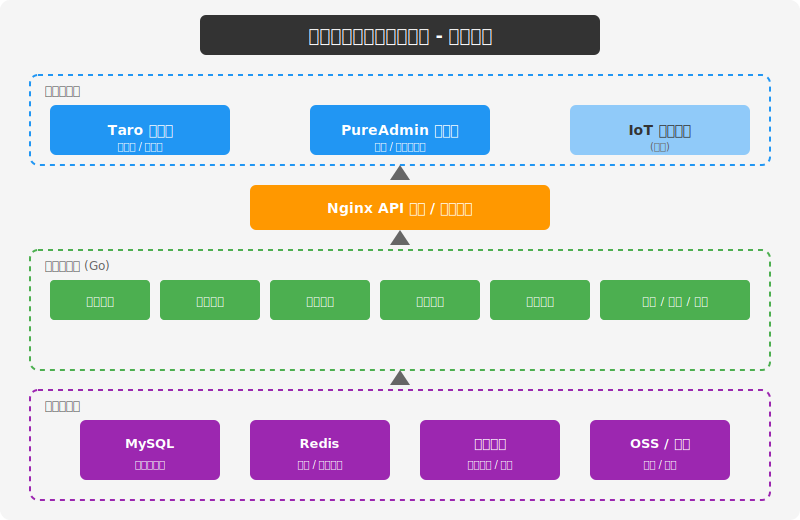

# PickupHelper - 快递代取与驿站管理系统

为校园/社区快递驿站量身定制的全流程管理平台。以"包裹"为数据核心，以"入库→通知→出库"为生命主轴，代取服务作为增值插件处理用户不便亲临的场景。

## 系统架构



## 功能模块

| 模块     | 说明                                                   | 状态             |
| -------- | ------------------------------------------------------ | ---------------- |
| 用户中心 | 手机号验证码登录、跑腿员申请与审核、信用分、黑名单     | ✅ Service层完成 |
| 包裹管理 | 扫码/手动/批量入库、取件码生成、货架自动分配、状态流转 | 🔲 待开发        |
| 取件核销 | 扫码/手动出库、自助出库、地理位置风控                  | 🔲 待开发        |
| 代取服务 | 任务发布、任务大厅、接单、临时取件码、双方确认         | 🔲 待开发        |
| 货架管理 | 货架布局、实时容量（乐观锁）、滞留件迁移               | 🔲 待开发        |
| 通知服务 | 入库通知、催取提醒、代取状态推送（微信订阅消息）       | 🔲 待开发        |
| 统计报表 | 流量统计、代取财务、快递公司对账                       | 🔲 待开发        |
| 定时任务 | 超时检测、自动退件、订单超时取消                       | 🔲 待开发        |

## 技术栈

| 层级     | 技术选型                        | 说明                            |
| -------- | ------------------------------- | ------------------------------- |
| 小程序端 | Taro 3.x + TypeScript           | 一套代码编译为微信/支付宝小程序 |
| 管理端   | PureAdmin (Vue3 + Element Plus) | 开箱即用的后台管理框架          |
| 后端     | Go 1.26+ + Gin + sqlx           | 单体应用模块化，原生 SQL        |
| 数据库   | MySQL 8.0                       | 主数据存储，支持事务            |
| 缓存     | Redis 7.0                       | 取件码缓存、分布式锁、会话存储  |
| 迁移     | Goose                           | 数据库版本管理                  |
| 日志     | slog                            | 结构化日志 + trace_id 链路追踪  |
| 测试     | testcontainers                  | 集成测试使用真实 MySQL/Redis    |

## 项目结构

> **注意**: 项目初期将后端代码直接放在了根目录，后续会迁移到 `backend/` 子目录以支持 monorepo 多端协作。

```
.
├── cmd/server/              # 服务入口
├── configs/                 # 配置文件（dev/test/prod）
├── internal/
│   ├── config/              # 配置加载（Viper）
│   ├── handler/             # HTTP 处理层
│   │   ├── health.go        # 健康检查端点
│   │   └── response.go      # 统一响应封装
│   ├── errors/              # 错误码定义
│   ├── log/                 # 日志封装（slog + trace_id）
│   ├── middleware/           # 中间件套件
│   │   ├── jwt.go           # JWT 鉴权
│   │   ├── cors.go          # 跨域处理
│   │   ├── ratelimit.go     # 令牌桶限流
│   │   ├── logger.go        # 请求日志
│   │   ├── recovery.go      # Panic 恢复
│   │   ├── trace.go         # 链路追踪 ID
│   │   └── validator.go     # 参数校验
│   ├── repository/          # 数据访问层
│   │   ├── mysql.go         # MySQL 连接池
│   │   ├── redis.go         # Redis 连接池
│   │   └── migrate.go       # 数据库迁移
│   ├── router/              # 路由注册
│   └── server/              # HTTP 服务器封装
├── migrations/              # Goose 迁移文件
├── test/                    # 集成测试
├── 需求规格说明/             # 需求文档
├── 详细设计文档/             # 设计文档
├── 可行性分析报告/           # 可行性报告
└── Makefile
```

## 开发进度

### Phase 01: 基础设施 ✅

| 阶段  | 内容                                                   | 状态 |
| ----- | ------------------------------------------------------ | ---- |
| 01-01 | 项目脚手架：config / log / repository / health handler | ✅   |
| 01-02 | Goose 迁移 + testcontainers 集成测试基础设施           | ✅   |
| 01-03 | 中间件套件 + 统一错误码/响应处理                       | ✅   |

### Phase 02: 用户模块 🚧

| 阶段  | 内容                                | 状态      |
| ----- | ----------------------------------- | --------- |
| 02-01 | Models + Repository 层 + Redis 缓存 | ✅        |
| 02-02 | Service 层（认证 + 用户信息）       | ✅        |
| 02-03 | Handler 层（API 接口）              | 🔲 待开发 |

### Phase 03+: 业务模块 🔲

| 阶段 | 内容                                  | 状态      |
| ---- | ------------------------------------- | --------- |
| 03   | 包裹管理模块（入库/状态流转/取件码）  | 🔲 待开发 |
| 04   | 取件核销模块（出库/风控/日志）        | 🔲 待开发 |
| 05   | 代取服务模块（发布/接单/确认/结算）   | 🔲 待开发 |
| 06   | 货架管理模块（布局/容量/迁移）        | 🔲 待开发 |
| 07   | 通知服务模块（微信订阅消息/异步队列） | 🔲 待开发 |
| 08   | 定时任务模块（超时检测/自动退件）     | 🔲 待开发 |
| 09   | 统计报表模块                          | 🔲 待开发 |
| 10   | 管理端前端对接                        | 🔲 待开发 |
| 11   | 小程序前端开发                        | 🔲 待开发 |

## 快速开始

### 环境要求

- Go 1.26+
- MySQL 8.0
- Redis 7.0
- goose (`go install github.com/pressly/goose/v3/cmd/goose@latest`)

### 安装与配置

```bash
# 克隆项目
git clone <repo-url>
cd PickupHelper-miniapp

# 安装依赖
go mod tidy

# 配置环境
cp configs/config.dev.yaml configs/config.local.yaml
# 编辑 configs/config.local.yaml，修改数据库和 Redis 连接信息
```

### 数据库迁移

```bash
# 创建数据库并执行迁移
make migrate-up

# 查看迁移状态
goose -dir migrations mysql "root:1973@tcp(127.0.0.1:3306)/pickup_helper?parseTime=true" status

# 回滚
make migrate-down
```

### 运行

```bash
# 开发模式
make run

# 或直接运行
APP_ENV=dev go run ./cmd/server
```

服务默认监听 `http://localhost:8080`

### 健康检查

```bash
# 存活探针（进程是否运行）
curl http://localhost:8080/health
# → {"code":0,"msg":"success","data":{"status":"up"}}

# 就绪探针（MySQL/Redis 是否可用）
curl http://localhost:8080/health/ready
# → {"code":0,"msg":"success","data":{"status":"ready"}}
```

## 测试

```bash
# 单元测试（快速，不依赖外部服务）
make test-unit

# 集成测试（需要 Docker，自动拉起 MySQL/Redis 容器）
make test-integration

# 全部测试
make test
```

## API 设计

统一前缀 `/api/v1`，JWT 鉴权，统一响应结构：

```json
{
  "code": 0,
  "msg": "success",
  "data": {},
  "trace_id": "abc123"
}
```

### 接口总览

| 模块 | 方法 | 路径                             | 说明                  | 权限          |
| ---- | ---- | -------------------------------- | --------------------- | ------------- |
| 认证 | POST | `/auth/send-code`              | 发送手机验证码        | 公开          |
| 认证 | POST | `/auth/login`                  | 手机号验证码登录/注册 | 公开          |
| 认证 | POST | `/auth/refresh`                | 刷新 Token            | 已登录        |
| 用户 | GET  | `/user/info`                   | 获取当前用户信息      | 已登录        |
| 用户 | PUT  | `/user/info`                   | 更新用户信息          | 已登录        |
| 用户 | POST | `/user/runner/apply`           | 申请成为跑腿员        | 普通用户      |
| 包裹 | POST | `/parcels/scan-in`             | 扫码/手动入库         | 管理员        |
| 包裹 | POST | `/parcels/batch-in`            | 批量导入（Excel）     | 管理员        |
| 包裹 | GET  | `/parcels`                     | 包裹列表              | 管理员/收件人 |
| 包裹 | GET  | `/parcels/my`                  | 我的包裹              | 收件人        |
| 取件 | POST | `/pickup/verify`               | 核销取件              | 管理员/跑腿员 |
| 取件 | POST | `/pickup/self-checkout`        | 用户自助出库          | 收件人        |
| 代取 | POST | `/proxy/publish`               | 发布代取任务          | 收件人        |
| 代取 | GET  | `/proxy/tasks`                 | 代取任务大厅          | 跑腿员        |
| 代取 | POST | `/proxy/accept/{id}`           | 接单                  | 跑腿员        |
| 代取 | POST | `/proxy/confirm-delivery/{id}` | 确认收货              | 收件人        |
| 货架 | GET  | `/shelves`                     | 货架列表及占用        | 管理员        |
| 货架 | POST | `/shelves`                     | 新增货架              | 管理员        |
| 统计 | GET  | `/stats/dashboard`             | 首页看板数据          | 管理员        |
| 统计 | GET  | `/stats/trend`                 | 包裹趋势图            | 管理员        |
| 统计 | GET  | `/stats/proxy-finance`         | 代取财务汇总          | 管理员        |

完整接口文档详见 [详细设计文档/快递代取与驿站管理系统详细设计文档.md](详细设计文档/快递代取与驿站管理系统详细设计文档.md)

## 错误码规范

| 范围        | 说明     |
| ----------- | -------- |
| 0           | 成功     |
| 10001~10099 | 通用错误 |
| 10101~10199 | 用户模块 |
| 10201~10299 | 包裹模块 |
| 10301~10399 | 取件模块 |
| 10401~10499 | 代取模块 |
| 10501~10599 | 货架模块 |
| 10601~10699 | 通知模块 |
| 99999       | 未知错误 |

## 核心业务流程

### 包裹入库与自取

```
快递员交付 → 管理员扫码入库 → 系统生成取件码 + 分配货架
    → 推送微信通知 → 用户到店出示取件码 → 管理员核销出库
```

### 代取服务

```
收件人发布代取任务（设置悬赏）
    → 跑腿员浏览任务大厅并接单
    → 系统生成一次性临时取件码
    → 跑腿员到店出示临时码取件
    → 配送达后点击"已送达"
    → 收件人确认收货 → 赏金结算
```

### 超时处理

| 时间阈值 | 处理                       |
| -------- | -------------------------- |
| 24 小时  | 推送微信催取通知           |
| 72 小时  | 标记为"滞留件"，通知管理员 |
| 7 天     | 自动发起退件流程           |

## 文档

- [需求规格说明书](需求规格说明/快递代取与驿站管理系统需求规格说明书.md) - 完整功能需求定义
- [详细设计文档](详细设计文档/快递代取与驿站管理系统详细设计文档.md) - 架构、数据库、接口设计
- [API 详细设计](详细设计文档/api详细设计.md) - 接口字段与业务规则
- [数据库设计文档](详细设计文档/数据库设计文档.md) - 表结构、SQL、索引策略
- [可行性分析报告](可行性分析报告/可行性分析报告.md) - 技术与业务可行性

## License

Private - 仅供内部使用
