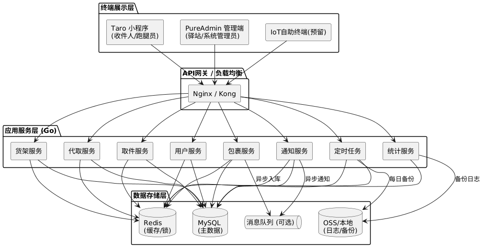
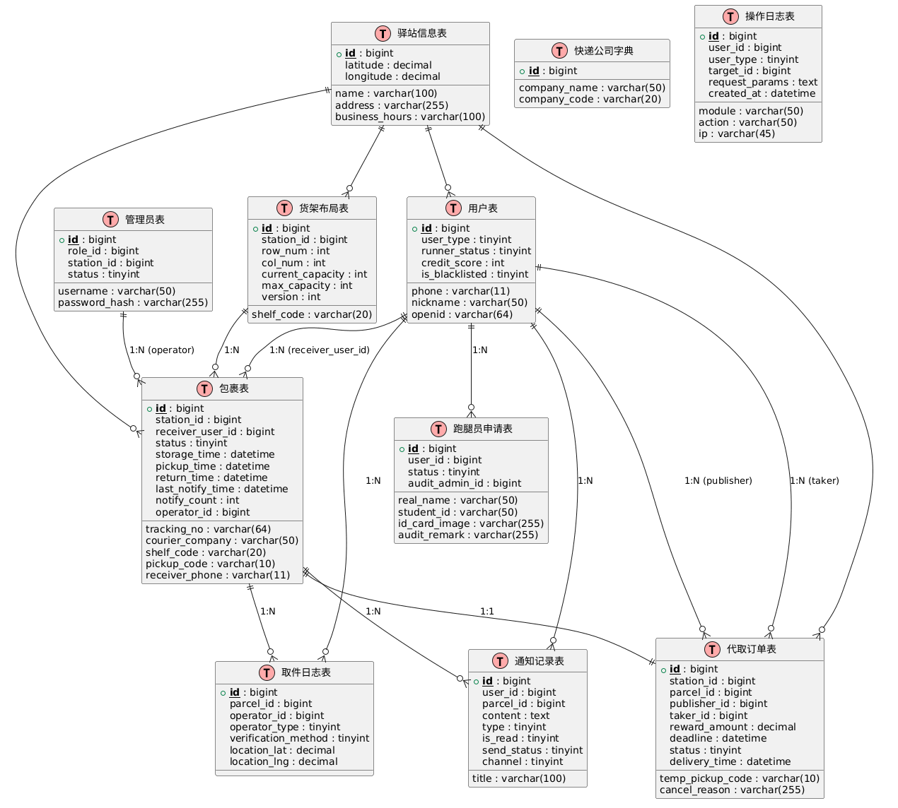
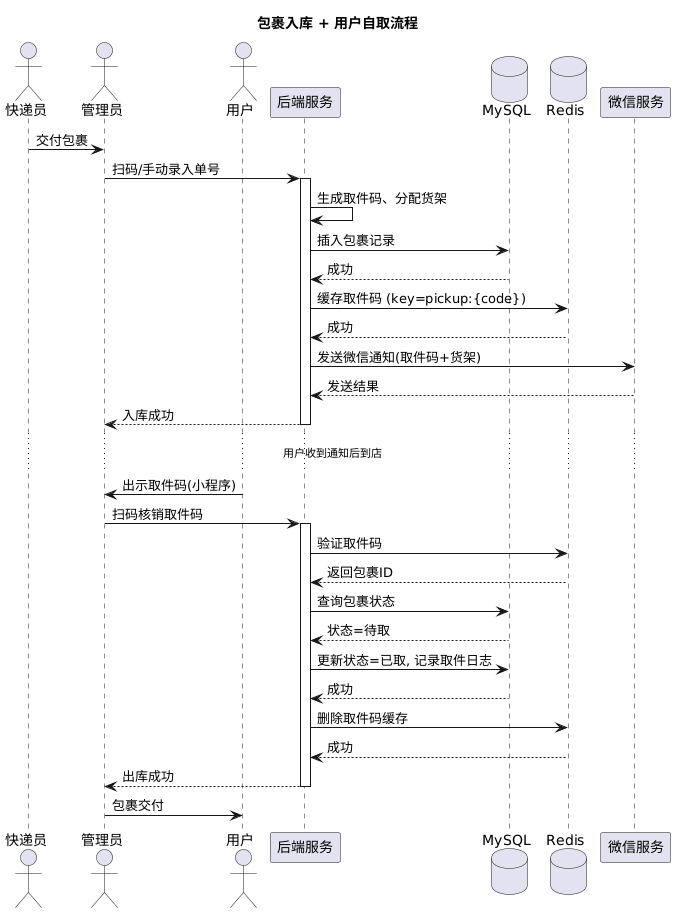
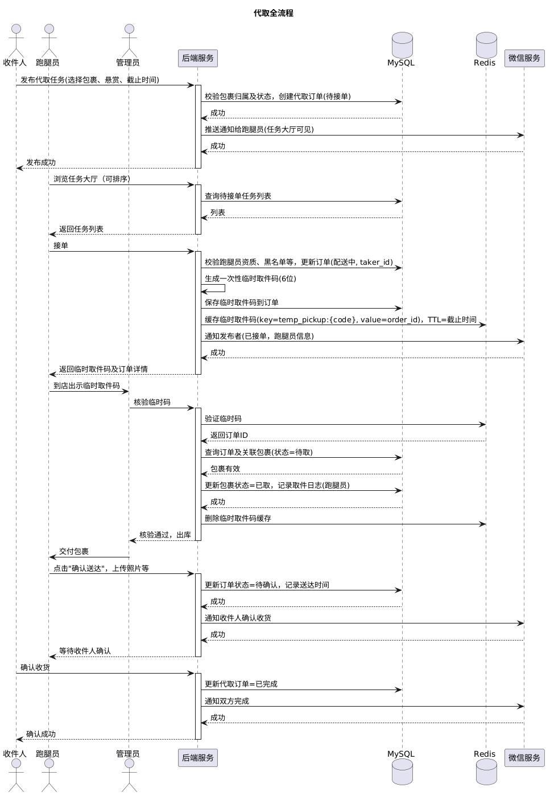
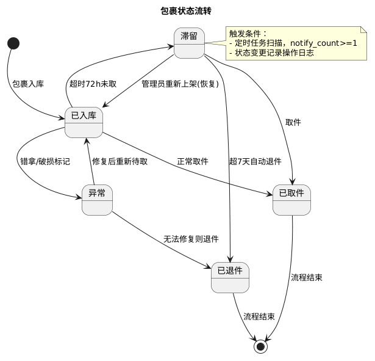
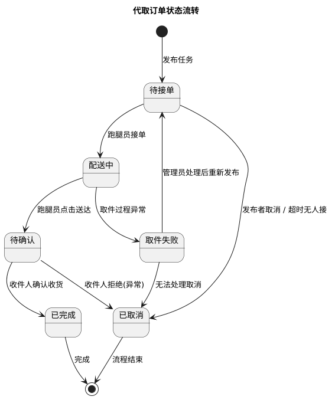

# 快递代取与驿站管理系统——详细设计文档

---

## 1. 总体架构设计

### 1.1 架构图（逻辑分层）



```
@startuml 总体架构图
!define RECTANGLE class

skinparam componentStyle rectangle

package "终端展示层" {
  [Taro 小程序\n(收件人/跑腿员)] as MiniApp
  [PureAdmin 管理端\n(驿站/系统管理员)] as AdminUI
  [IoT自助终端(预留)] as IoT
}

package "API网关 / 负载均衡" {
  [Nginx] as Gateway
}

package "应用服务层 (Go)" {
  [用户服务] as UserSvc
  [包裹服务] as ParcelSvc
  [取件服务] as PickupSvc
  [代取服务] as ProxySvc
  [货架服务] as ShelfSvc
  [通知服务] as NotifySvc
  [统计服务] as StatsSvc
  [定时任务] as CronSvc
}

package "数据存储层" {
  database "MySQL\n(主数据)" as MySQL
  database "Redis\n(缓存/锁)" as Redis
  database "OSS/本地\n(日志/备份)" as OSS
  queue "消息队列\n(RabbitMQ/Kafka)" as MQ
}

MiniApp --> Gateway
AdminUI --> Gateway
IoT --> Gateway
Gateway --> UserSvc
Gateway --> ParcelSvc
Gateway --> PickupSvc
Gateway --> ProxySvc
Gateway --> ShelfSvc
Gateway --> NotifySvc
Gateway --> StatsSvc
Gateway --> CronSvc

UserSvc --> MySQL
UserSvc --> Redis
ParcelSvc --> MySQL
ParcelSvc --> Redis
PickupSvc --> MySQL
PickupSvc --> Redis
ProxySvc --> MySQL
ProxySvc --> Redis
ShelfSvc --> MySQL
ShelfSvc --> Redis
NotifySvc --> MySQL
NotifySvc --> Redis
StatsSvc --> MySQL
CronSvc --> MySQL
CronSvc --> Redis

ParcelSvc --> MQ : 异步入库
NotifySvc --> MQ : 异步通知
StatsSvc --> OSS : 备份日志
CronSvc --> OSS : 每日备份

@enduml
```

### 1.2 技术栈

| 层级       | 技术选型                                    | 说明                             |
| ---------- | ------------------------------------------- | -------------------------------- |
| 小程序端   | **Taro 3.x** (React/Vue) + TypeScript | 一套代码编译为微信/支付宝小程序  |
| 管理端     | **PureAdmin** (Vue3 + Element Plus)   | 开箱即用的后台管理框架，内置RBAC |
| 后端       | **Go 1.20+** + Gin + sqlx             | 单体应用模块化，原生 SQL，后续可拆分 |
| 数据库     | MySQL 8.0                                   | 主数据存储，支持事务，读写分离   |
| 缓存       | Redis 7.0                                   | 取件码缓存、分布式锁、会话存储   |
| 消息队列   | RabbitMQ / Kafka                            | 异步入库、通知异步化             |
| 定时任务   | robfig/cron + Redis分布式锁                 | 超时处理、备份、统计             |
| 文件存储   | 本地/阿里云OSS                              | 二维码图片、日志备份             |
| 第三方依赖 | 微信订阅消息                                | 服务通知                         |

---

## 2. 模块划分与职责

### 2.1 用户中心模块

- 收件人注册/登录（手机号+验证码）
- 跑腿员资质申请与审核
- 管理员账号管理（系统管理员分配）
- 用户信息维护、黑名单管理
- 信用分计算与冻结

### 2.2 包裹管理模块

- 包裹入库（扫码/手动/批量导入）
- 取件码生成与分配
- 货架分配（自动/手动）
- 包裹生命周期状态流转
- 包裹查询与列表（按手机号、单号、状态）

### 2.3 取件核销模块

- 取件码验证（自取/代取）
- 出库操作（扫码/手动/批量）
- 地理位置风控校验
- 取件日志记录

### 2.4 代取服务模块

- 代取任务发布（悬赏设置）
- 任务大厅列表（排序、筛选）
- 接单、授权码生成
- 配送确认（双方确认机制）
- 收益记录（悬赏金额）

### 2.5 货架管理模块

- 货架布局定义（排/列/容量）
- 实时容量更新（乐观锁）
- 滞留件自动迁移
- 货架占用可视化

### 2.6 通知与消息模块

- 入库通知（微信订阅消息/短信）
- 滞留催取通知（控制频次）
- 代取状态通知（发布、接单、完成）
- 管理员告警（超时、异常）

### 2.7 统计与报表模块

- 包裹流量统计（日/周/月/年）
- 代取财务统计
- 快递公司对账
- 操作日志审计

### 2.8 定时任务模块

- 超时检测与状态更新（使用notify_count控制催取次数）
- 自动退件流程
- 每日数据备份
- 报表生成
- 代取订单超时取消

---

## 3. 数据库详细设计

本系统采用 MySQL 8.0 作为主数据存储，使用 sqlx + 原生 SQL 进行数据访问，无 ORM 抽象层。完整的表结构 DDL、所有 CRUD SQL 语句、使用场景、事务边界、并发控制策略与索引优化方案，已独立拆分至详细数据库设计文档：

👉 [数据库设计文档.md](./数据库设计文档.md)

下文保留 ER 图与表结构概览，便于快速理解实体关系。各表的详细字段定义、SQL 语句与业务逻辑以引用文档为准。

### 3.1 ER 图（核心表关系）



```
@startuml ER图（核心表关系）
!define Table(name, desc) class name as "desc" << (T,#FFAAAA) >>
!define primary_key(x) <b><u>x</u></b>
!define foreign_key(x) <i>x</i>

Table(stations, 驿站信息表) {
  + primary_key(id) : bigint
  name : varchar(100)
  address : varchar(255)
  latitude : decimal
  longitude : decimal
  business_hours : varchar(100)
}

Table(users, 用户表) {
  + primary_key(id) : bigint
  phone : varchar(11)
  nickname : varchar(50)
  openid : varchar(64)
  user_type : tinyint
  runner_status : tinyint
  credit_score : int
  is_blacklisted : tinyint
}

Table(admins, 管理员表) {
  + primary_key(id) : bigint
  username : varchar(50)
  password_hash : varchar(255)
  role_id : bigint
  station_id : bigint
  status : tinyint
}

Table(parcels, 包裹表) {
  + primary_key(id) : bigint
  station_id : bigint
  tracking_no : varchar(64)
  courier_company : varchar(50)
  shelf_code : varchar(20)
  pickup_code : varchar(10)
  receiver_phone : varchar(11)
  receiver_user_id : bigint
  status : tinyint
  storage_time : datetime
  pickup_time : datetime
  return_time : datetime
  last_notify_time : datetime
  notify_count : int
  operator_id : bigint
}

Table(pickup_logs, 取件日志表) {
  + primary_key(id) : bigint
  parcel_id : bigint
  operator_id : bigint
  operator_type : tinyint
  verification_method : tinyint
  location_lat : decimal
  location_lng : decimal
}

Table(proxy_orders, 代取订单表) {
  + primary_key(id) : bigint
  station_id : bigint
  parcel_id : bigint
  publisher_id : bigint
  taker_id : bigint
  reward_amount : decimal
  temp_pickup_code : varchar(10)
  deadline : datetime
  status : tinyint
  cancel_reason : varchar(255)
  delivery_time : datetime
}

Table(shelf_layout, 货架布局表) {
  + primary_key(id) : bigint
  station_id : bigint
  shelf_code : varchar(20)
  row_num : int
  col_num : int
  current_capacity : int
  max_capacity : int
  version : int
}

Table(notifications, 通知记录表) {
  + primary_key(id) : bigint
  user_id : bigint
  parcel_id : bigint
  title : varchar(100)
  content : text
  type : tinyint
  is_read : tinyint
  send_status : tinyint
  channel : tinyint
}

Table(runner_applications, 跑腿员申请表) {
  + primary_key(id) : bigint
  user_id : bigint
  real_name : varchar(50)
  student_id : varchar(50)
  id_card_image : varchar(255)
  status : tinyint
  audit_admin_id : bigint
  audit_remark : varchar(255)
}

Table(courier_companies, 快递公司字典) {
  + primary_key(id) : bigint
  company_name : varchar(50)
  company_code : varchar(20)
}

Table(operation_logs, 操作日志表) {
  + primary_key(id) : bigint
  user_id : bigint
  user_type : tinyint
  module : varchar(50)
  action : varchar(50)
  target_id : bigint
  request_params : text
  ip : varchar(45)
  created_at : datetime
}

stations ||--o{ users : ""
stations ||--o{ parcels : ""
stations ||--o{ proxy_orders : ""
stations ||--o{ shelf_layout : ""
users ||--o{ parcels : "1:N (receiver_user_id)"
users ||--o{ proxy_orders : "1:N (publisher)"
users ||--o{ proxy_orders : "1:N (taker)"
users ||--o{ pickup_logs : "1:N"
admins ||--o{ parcels : "1:N (operator)"
parcels ||--|| proxy_orders : "1:1"
parcels ||--o{ pickup_logs : "1:N"
shelf_layout ||--o{ parcels : "1:N"
users ||--o{ notifications : "1:N"
parcels ||--o{ notifications : "1:N"
users ||--o{ runner_applications : "1:N"

@enduml
```

### 3.2 表结构详细（DDL 片段）

#### 驿站信息表 `stations`

```sql
CREATE TABLE `stations` (
  `id` bigint PRIMARY KEY AUTO_INCREMENT,
  `name` varchar(100) NOT NULL,
  `address` varchar(255),
  `latitude` decimal(10,7),
  `longitude` decimal(10,7),
  `business_hours` varchar(100) DEFAULT '09:00-20:00',
  `status` tinyint DEFAULT 1 COMMENT '1-营业中, 0-休息中',
  `created_at` datetime DEFAULT CURRENT_TIMESTAMP,
  `updated_at` datetime DEFAULT CURRENT_TIMESTAMP ON UPDATE CURRENT_TIMESTAMP
);
```

#### 用户表 `users`

```sql
CREATE TABLE `users` (
  `id` bigint PRIMARY KEY AUTO_INCREMENT,
  `phone` varchar(11) NOT NULL UNIQUE COMMENT '手机号',
  `nickname` varchar(50) DEFAULT '',
  `avatar` varchar(255) DEFAULT '',
  `openid` varchar(64) UNIQUE COMMENT '微信openid',
  `user_type` tinyint DEFAULT 1 COMMENT '1-普通收件人, 2-跑腿员',
  `runner_status` tinyint DEFAULT 0 COMMENT '0-未申请, 1-审核中, 2-已通过, 3-已拒绝',
  `credit_score` int DEFAULT 100 COMMENT '信用分',
  `is_blacklisted` tinyint DEFAULT 0 COMMENT '是否黑名单',
  `created_at` datetime DEFAULT CURRENT_TIMESTAMP,
  `updated_at` datetime DEFAULT CURRENT_TIMESTAMP ON UPDATE CURRENT_TIMESTAMP,
  INDEX idx_phone (`phone`),
  INDEX idx_openid (`openid`)
);
```

#### 管理员表 `admins`

```sql
CREATE TABLE `admins` (
  `id` bigint PRIMARY KEY AUTO_INCREMENT,
  `username` varchar(50) NOT NULL UNIQUE,
  `password_hash` varchar(255) NOT NULL,
  `role_id` bigint NOT NULL COMMENT '关联权限角色',
  `station_id` bigint DEFAULT NULL COMMENT '所属驿站（系统管理员为空）',
  `real_name` varchar(50),
  `phone` varchar(11),
  `status` tinyint DEFAULT 1 COMMENT '1-启用, 0-禁用',
  `last_login` datetime,
  `created_at` datetime DEFAULT CURRENT_TIMESTAMP,
  INDEX idx_station (`station_id`)
);
```

#### 跑腿员申请表 `runner_applications`

```sql
CREATE TABLE `runner_applications` (
  `id` bigint PRIMARY KEY AUTO_INCREMENT,
  `user_id` bigint NOT NULL,
  `real_name` varchar(50) NOT NULL,
  `student_id` varchar(50) COMMENT '学号/工号',
  `id_card_image` varchar(255) COMMENT '证件照',
  `status` tinyint DEFAULT 1 COMMENT '1-审核中, 2-通过, 3-拒绝',
  `audit_admin_id` bigint DEFAULT NULL,
  `audit_remark` varchar(255),
  `created_at` datetime DEFAULT CURRENT_TIMESTAMP,
  `updated_at` datetime DEFAULT CURRENT_TIMESTAMP ON UPDATE CURRENT_TIMESTAMP,
  INDEX idx_user (`user_id`),
  INDEX idx_status (`status`)
);
```

#### 包裹表 `parcels`

```sql
CREATE TABLE `parcels` (
  `id` bigint PRIMARY KEY AUTO_INCREMENT,
  `station_id` bigint NOT NULL COMMENT '所属驿站',
  `tracking_no` varchar(64) NOT NULL COMMENT '快递单号',
  `courier_company` varchar(50) NOT NULL COMMENT '快递公司',
  `shelf_code` varchar(20) DEFAULT NULL COMMENT '货架编号',
  `pickup_code` varchar(10) NOT NULL COMMENT '6位取件码',
  `receiver_phone` varchar(11) NOT NULL,
  `receiver_user_id` bigint DEFAULT NULL COMMENT '关联注册用户',
  `receiver_name` varchar(50) DEFAULT NULL,
  `weight` decimal(10,2) DEFAULT 0,
  `is_fragile` tinyint DEFAULT 0,
  `remarks` varchar(255) DEFAULT NULL,
  `status` tinyint DEFAULT 1 COMMENT '1-待取, 2-已取, 3-滞留, 4-已退件, 5-异常(错拿/破损)',
  `storage_time` datetime NOT NULL,
  `pickup_time` datetime DEFAULT NULL,
  `return_time` datetime DEFAULT NULL,
  `last_notify_time` datetime DEFAULT NULL COMMENT '最近一次催取通知时间',
  `notify_count` int DEFAULT 0 COMMENT '催取通知次数',
  `operator_id` bigint DEFAULT NULL COMMENT '入库操作管理员ID',
  `updated_at` datetime DEFAULT CURRENT_TIMESTAMP ON UPDATE CURRENT_TIMESTAMP,
  UNIQUE KEY uk_tracking_station (`tracking_no`, `station_id`),
  UNIQUE KEY uk_pickup_code_station (`pickup_code`, `station_id`) COMMENT '取件码在驿站内全局唯一，避免状态变更时竞态分配',
  INDEX idx_receiver_phone (`receiver_phone`),
  INDEX idx_receiver_user_id (`receiver_user_id`),
  INDEX idx_status (`status`),
  INDEX idx_shelf (`shelf_code`),
  INDEX idx_storage_time (`storage_time`),
  INDEX idx_station (`station_id`),
  INDEX idx_station_status (`station_id`, `status`),
  INDEX idx_station_storage_time (`station_id`, `storage_time`)
);
```

#### 取件日志表 `pickup_logs`

```sql
CREATE TABLE `pickup_logs` (
  `id` bigint PRIMARY KEY AUTO_INCREMENT,
  `parcel_id` bigint NOT NULL,
  `operator_id` bigint DEFAULT NULL COMMENT '操作人ID（用户/管理员）',
  `operator_type` tinyint NOT NULL COMMENT '1-管理员, 2-自助机, 3-跑腿员, 4-本人',
  `verification_method` tinyint NOT NULL COMMENT '1-扫码取件码, 2-手动输入, 3-人脸核验',
  `location_lat` decimal(10,7) DEFAULT NULL,
  `location_lng` decimal(10,7) DEFAULT NULL,
  `ip_address` varchar(45) DEFAULT NULL,
  `user_agent` varchar(255) DEFAULT NULL,
  `created_at` datetime DEFAULT CURRENT_TIMESTAMP,
  INDEX idx_parcel (`parcel_id`),
  INDEX idx_operator (`operator_id`)
);
```

#### 代取订单表 `proxy_orders`

```sql
CREATE TABLE `proxy_orders` (
  `id` bigint PRIMARY KEY AUTO_INCREMENT,
  `station_id` bigint NOT NULL,
  `parcel_id` bigint NOT NULL,
  `publisher_id` bigint NOT NULL COMMENT '收件人用户ID',
  `taker_id` bigint DEFAULT NULL COMMENT '跑腿员用户ID',
  `reward_amount` decimal(10,2) NOT NULL COMMENT '悬赏金额',
  `temp_pickup_code` varchar(10) DEFAULT NULL COMMENT '临时取件码（一次性）',
  `deadline` datetime NOT NULL COMMENT '取件截止时间',
  `status` tinyint DEFAULT 1 COMMENT '1-待接单, 2-配送中(已取件), 3-已完成, 4-已取消, 5-超时未接, 6-取件失败',
  `cancel_reason` varchar(255) DEFAULT NULL,
  `delivery_time` datetime DEFAULT NULL COMMENT '配送完成时间',
  `created_at` datetime DEFAULT CURRENT_TIMESTAMP,
  `updated_at` datetime DEFAULT CURRENT_TIMESTAMP ON UPDATE CURRENT_TIMESTAMP,
  UNIQUE KEY uk_parcel (parcel_id),
  INDEX idx_publisher (`publisher_id`),
  INDEX idx_taker (`taker_id`),
  INDEX idx_status (`status`),
  INDEX idx_station (`station_id`),
  INDEX idx_created_at (`created_at`),
  INDEX idx_station_status (`station_id`, `status`)
);
```

#### 货架布局表 `shelf_layout`

```sql
CREATE TABLE `shelf_layout` (
  `id` bigint PRIMARY KEY AUTO_INCREMENT,
  `station_id` bigint NOT NULL,
  `shelf_code` varchar(20) NOT NULL COMMENT '如 A-01',
  `row_num` int NOT NULL COMMENT '排数',
  `col_num` int NOT NULL COMMENT '列数',
  `current_capacity` int DEFAULT 0 COMMENT '当前占用包裹数',
  `max_capacity` int NOT NULL COMMENT '最大容量',
  `version` int DEFAULT 0 COMMENT '乐观锁版本号',
  `remark` varchar(255) DEFAULT NULL,
  `created_at` datetime DEFAULT CURRENT_TIMESTAMP,
  `updated_at` datetime DEFAULT CURRENT_TIMESTAMP ON UPDATE CURRENT_TIMESTAMP,
  UNIQUE KEY uk_station_shelf (`station_id`, `shelf_code`),
  INDEX idx_station (`station_id`)
);
```

#### 通知记录表 `notifications`

```sql
CREATE TABLE `notifications` (
  `id` bigint PRIMARY KEY AUTO_INCREMENT,
  `user_id` bigint NOT NULL,
  `parcel_id` bigint DEFAULT NULL,
  `title` varchar(100) NOT NULL,
  `content` text NOT NULL,
  `type` tinyint NOT NULL COMMENT '1-入库,2-催取,3-代取状态,4-系统',
  `is_read` tinyint DEFAULT 0,
  `send_status` tinyint DEFAULT 0 COMMENT '0-待发送, 1-已发送, 2-发送失败',
  `channel` tinyint DEFAULT 1 COMMENT '1-微信订阅消息, 2-短信',
  `created_at` datetime DEFAULT CURRENT_TIMESTAMP,
  INDEX idx_user (`user_id`),
  INDEX idx_parcel (`parcel_id`),
  INDEX idx_send_status (`send_status`),
  INDEX idx_user_read (`user_id`, `is_read`)
);

#### 快递公司字典表 `courier_companies`

```sql
CREATE TABLE `courier_companies` (
  `id` bigint PRIMARY KEY AUTO_INCREMENT,
  `company_name` varchar(50) NOT NULL,
  `company_code` varchar(20) NOT NULL COMMENT '快递100编码等',
  `created_at` datetime DEFAULT CURRENT_TIMESTAMP
);
```

#### 操作日志表 `operation_logs`

```sql
CREATE TABLE `operation_logs` (
  `id` bigint PRIMARY KEY AUTO_INCREMENT,
  `user_id` bigint COMMENT '操作人ID',
  `user_type` tinyint COMMENT '1-管理员, 2-用户, 3-系统',
  `module` varchar(50) COMMENT '模块',
  `action` varchar(50) COMMENT '操作',
  `target_id` bigint COMMENT '操作对象ID',
  `request_params` text COMMENT '请求参数JSON',
  `ip` varchar(45),
  `created_at` datetime DEFAULT CURRENT_TIMESTAMP,
  INDEX idx_user (`user_id`),
  INDEX idx_module (`module`, `action`),
  INDEX idx_created (`created_at`)
);
```

---

## 4. 核心接口设计（RESTful API）

本系统的接口设计采用 RESTful 风格，统一前缀 `/api/v1`，使用 JWT 鉴权与统一响应结构。完整的接口命名规范、鉴权方式、分页约定、错误码定义以及各模块（用户/包裹/取件核销/代取/货架/统计/驿站管理）每一个接口的请求体、响应体、字段语义、校验规则与业务错误码，已独立拆分至详细 API 设计文档：

👉 [api详细设计.md](./api详细设计.md)

下文仅保留接口总览，便于快速检索。各接口的详细字段与行为以引用文档为准。

### 4.1 接口总览

#### 用户模块

| 方法 | 路径                                     | 说明                     | 权限     |
| ---- | ---------------------------------------- | ------------------------ | -------- |
| POST | `/auth/send-code`                      | 发送手机验证码           | 公开     |
| POST | `/auth/login`                          | 手机号验证码登录/注册    | 公开     |
| POST | `/auth/refresh`                        | 刷新Token                | 已登录   |
| GET  | `/user/info`                           | 获取当前用户信息         | 已登录   |
| PUT  | `/user/info`                           | 更新用户信息             | 已登录   |
| POST | `/user/runner/apply`                   | 申请成为跑腿员（含资料） | 普通用户 |
| GET  | `/user/runner/applications`            | 查看申请列表             | 管理员   |
| PUT  | `/user/runner/applications/{id}/audit` | 审核跑腿员申请           | 管理员   |

#### 包裹模块

| 方法 | 路径                          | 说明                     | 权限          |
| ---- | ----------------------------- | ------------------------ | ------------- |
| POST | `/parcels/scan-in`          | 扫码/手动入库            | 管理员        |
| POST | `/parcels/batch-in`         | 批量导入（Excel，异步）  | 管理员        |
| GET  | `/parcels`                  | 包裹列表（分页、筛选）   | 管理员/收件人 |
| GET  | `/parcels/{id}`             | 包裹详情                 | 管理员/本人   |
| PUT  | `/parcels/{id}/status`      | 更改状态（异常、退件等） | 管理员        |
| GET  | `/parcels/my`               | 我的包裹（待取+历史）    | 收件人        |
| GET  | `/parcels/{id}/pickup-code` | 获取取件码（展示二维码） | 本人          |

#### 取件核销模块

| 方法 | 路径                      | 说明                           | 权限          |
| ---- | ------------------------- | ------------------------------ | ------------- |
| POST | `/pickup/verify`        | 核销取件（扫码/手动）          | 管理员/跑腿员 |
| POST | `/pickup/self-checkout` | 用户自助出库（确认码+位置）    | 收件人        |
| POST | `/pickup/scan-station`  | 扫驿站二维码获取包裹列表并出库 | 收件人        |
| GET  | `/pickup/logs`          | 取件日志查询（分页）           | 管理员        |

#### 代取模块

| 方法 | 路径                             | 说明                         | 权限          |
| ---- | -------------------------------- | ---------------------------- | ------------- |
| POST | `/proxy/publish`               | 发布代取任务                 | 收件人        |
| GET  | `/proxy/tasks`                 | 代取任务大厅列表（排序筛选） | 跑腿员        |
| POST | `/proxy/accept/{id}`           | 接单                         | 跑腿员        |
| POST | `/proxy/request-delivery/{id}` | 跑腿员发起送达确认           | 跑腿员        |
| POST | `/proxy/confirm-delivery/{id}` | 收件人确认收货               | 收件人        |
| POST | `/proxy/cancel`                | 取消订单（含原因）           | 发布者/跑腿员 |
| GET  | `/proxy/my-orders`             | 我的代取订单                 | 收件人/跑腿员 |

#### 货架模块

| 方法 | 路径                   | 说明               | 权限   |
| ---- | ---------------------- | ------------------ | ------ |
| GET  | `/shelves`           | 货架列表及占用     | 管理员 |
| POST | `/shelves`           | 新增货架           | 管理员 |
| PUT  | `/shelves/{id}`      | 更新货架配置       | 管理员 |
| GET  | `/shelves/occupancy` | 货架占用热力图数据 | 管理员 |

#### 统计模块

| 方法 | 路径                     | 说明         | 权限   |
| ---- | ------------------------ | ------------ | ------ |
| GET  | `/stats/dashboard`     | 首页看板数据 | 管理员 |
| GET  | `/stats/trend`         | 包裹趋势图   | 管理员 |
| GET  | `/stats/proxy-finance` | 代取财务汇总 | 管理员 |
| GET  | `/stats/courier-check` | 快递公司对账 | 管理员 |

#### 驿站管理模块（系统管理员）

| 方法 | 路径               | 说明         | 权限       |
| ---- | ------------------ | ------------ | ---------- |
| GET  | `/stations`      | 驿站列表     | 系统管理员 |
| POST | `/stations`      | 新增驿站     | 系统管理员 |
| PUT  | `/stations/{id}` | 编辑驿站信息 | 系统管理员 |

---

## 5. 核心业务流程时序图

### 5.1 包裹入库 + 用户自取



```
@startuml 包裹入库与用户自取时序图
title 包裹入库 + 用户自取流程

actor "快递员" as Courier
actor "管理员" as Admin
actor "用户" as User
participant "后端服务" as Backend
database "MySQL" as DB
database "Redis" as Cache
participant "消息队列" as MQ
participant "微信服务" as Wechat

Courier -> Admin : 交付包裹
Admin -> Backend : 扫码/手动录入单号
activate Backend
Backend -> Backend : 校验参数，生成取件码、分配货架
Backend -> DB : 插入包裹记录（含notify_count=0）
DB --> Backend : 成功
Backend -> Cache : 缓存取件码 (key=pickup:{code}, value=parcel_id)
Cache --> Backend : 成功
Backend -> MQ : 发送通知消息（异步）
Backend --> Admin : 入库成功，返回取件码和货架
deactivate Backend

MQ -> Backend : 消费通知消息
activate Backend
Backend -> Wechat : 调用订阅消息接口（入库通知）
Wechat --> Backend : 发送结果
Backend -> DB : 更新通知记录send_status
deactivate Backend

... 用户收到通知后到店 ...

User -> Admin : 出示取件码(小程序)
Admin -> Backend : 扫码核销取件码
activate Backend
Backend -> Cache : 验证取件码存在性
Cache --> Backend : 返回包裹ID
Backend -> DB : 查询包裹状态（待取）
DB --> Backend : 状态=待取
Backend -> DB : 更新状态=已取，记录取件日志
DB --> Backend : 成功
Backend -> Cache : 删除取件码缓存
Cache --> Backend : 成功
Backend --> Admin : 出库成功
deactivate Backend
Admin -> User : 包裹交付
@enduml
```

### 5.2 代取全流程



```
@startuml 代取全流程时序图
title 代取全流程

actor "收件人" as Publisher
actor "跑腿员" as Taker
actor "管理员" as Admin
participant "后端服务" as Backend
database "MySQL" as DB
database "Redis" as Cache
participant "微信服务" as Wechat

Publisher -> Backend : 发布代取任务(选择包裹、悬赏、截止时间)
activate Backend
Backend -> DB : 校验包裹归属及状态，创建代取订单(待接单)
DB --> Backend : 成功
Backend -> Wechat : 推送通知给跑腿员(任务大厅可见)
Wechat --> Backend : 成功
Backend --> Publisher : 发布成功
deactivate Backend

Taker -> Backend : 浏览任务大厅（可排序）
activate Backend
Backend -> DB : 查询待接单任务列表
DB --> Backend : 列表
Backend --> Taker : 返回任务列表
deactivate Backend

Taker -> Backend : 接单
activate Backend
Backend -> DB : 校验跑腿员资质、黑名单等，更新订单(配送中, taker_id)
Backend -> Backend : 生成一次性临时取件码(6位)
Backend -> DB : 保存临时取件码到订单
Backend -> Cache : 缓存临时取件码(key=temp_pickup:{code}, value=order_id)，TTL=截止时间
Backend -> Wechat : 通知发布者(已接单，跑腿员信息)
Wechat --> Backend : 成功
Backend --> Taker : 返回临时取件码及订单详情
deactivate Backend

Taker -> Admin : 到店出示临时取件码
Admin -> Backend : 核验临时码
activate Backend
Backend -> Cache : 验证临时码
Cache --> Backend : 返回订单ID
Backend -> DB : 查询订单及关联包裹(状态=待取)
DB --> Backend : 包裹有效
Backend -> DB : 更新包裹状态=已取，记录取件日志(跑腿员)
DB --> Backend : 成功
Backend -> Cache : 删除临时取件码缓存
Backend --> Admin : 核验通过，出库
deactivate Backend
Admin -> Taker : 交付包裹

Taker -> Backend : 点击"确认送达"，上传照片等
activate Backend
Backend -> DB : 更新订单状态=待确认，记录送达时间
DB --> Backend : 成功
Backend -> Wechat : 通知收件人确认收货
Wechat --> Backend : 成功
Backend --> Taker : 等待收件人确认
deactivate Backend

Publisher -> Backend : 确认收货
activate Backend
Backend -> DB : 更新代取订单=已完成
Backend -> Wechat : 通知双方完成
Wechat --> Backend : 成功
Backend --> Publisher : 确认成功
deactivate Backend
@enduml
```

---

## 6. 关键模块技术实现要点

### 6.1 取件码生成与验证

- **生成规则**：`pickup_code = HMAC-SHA256(parcel_id + receiver_phone_suffix + station_id, secret) % 1000000`，补零为6位。若生成的取件码在同一驿站、同一状态（待取）下已存在，则递增重试直到唯一。插入包裹记录时使用乐观锁或唯一约束保证。
- **缓存策略**：入库时写入 Redis，key = `pickup:{code}:{station_id}`，value = parcel_id，TTL = 7天（默认退件周期）。验证时优先 Redis，若无则查数据库。出库后立即删除缓存。
- **一次性使用**：取件后删除缓存，并更新状态为已取，取件码不再有效。
- **临时取件码**（代取）：独立生成，规则类似，但绑定代取订单ID，缓存 key = `temp_pickup:{code}`，TTL为订单截止时间。

### 6.2 货架分配策略

- **自动分配**：根据当前货架占用率，查询 `shelf_layout` 表 `WHERE station_id=? AND current_capacity < max_capacity ORDER BY (current_capacity/max_capacity) ASC LIMIT 1`，并执行 `UPDATE ... SET current_capacity = current_capacity + 1, version = version + 1 WHERE id=? AND version=?` 乐观锁更新。若失败重试。
- **手动分配**：管理员扫码时可手动选择货架，后端同样进行容量检查与乐观锁更新。
- **批量分配**：对每个包裹循环执行上述逻辑。
- **容量释放**：出库或退件时，更新对应货架 `current_capacity = current_capacity - 1`，需在同一个事务中保证一致性。

### 6.3 超时滞留处理（定时任务）

- 使用 `robfig/cron` 库，每30分钟执行一次。
- 分布式锁：Redis `SET lock_key unique_value NX EX 1800`，获取锁后执行，释放时校验value。
- 扫描条件：
  - 催取：`status=1 AND storage_time < NOW() - INTERVAL 24 HOUR AND (last_notify_time IS NULL OR last_notify_time < NOW() - INTERVAL 24 HOUR) AND notify_count < 3`。推送催取订阅消息，更新 `last_notify_time`，`notify_count+1`。
  - 滞留：`status=1 AND storage_time < NOW() - INTERVAL 72 HOUR AND notify_count >= 1`，更新状态为3（滞留），记录日志，发送管理员告警。
  - 退件：`status=3 AND storage_time < NOW() - INTERVAL 7 DAY`，更新状态为4（已退件），`return_time=NOW()`，释放货架容量，通知收件人。
- 代取订单超时：`status=1 AND created_at < NOW() - INTERVAL 2 HOUR`，自动标记为状态5（超时未接），释放包裹关联，通知发布者。

### 6.4 风控校验（取件时）

- **地理位置**：取件时获取用户小程序经纬度，与所属驿站经纬度计算距离。若 > 500m 且操作者为`本人`或`跑腿员`，则记录可疑日志，标记为异常取件，强制管理员介入确认。
- **频次控制**：同一用户（user_id）5分钟内取件超过5个（自取），使用Redis滑动窗口计数，超过阈值则在管理端告警并记录。
- **黑名单校验**：取件前检查用户 `is_blacklisted` 字段，若为1则拒绝操作，提示联系管理员。

### 6.5 微信订阅消息对接

- 统一封装 `NotificationService`。
- 入库通知：使用“包裹入库通知”模板，需用户在小程序内授权。入库时异步通过MQ发送，发送前检查用户是否已授权该模板，若未授权则仅记录通知但不发送，并引导授权。
- 滞留催取：使用“包裹滞留提醒”模板，同样需授权。
- 代取状态通知：接单、送达请求、确认收货等，使用相应模板。
- 所有发送记录写入 `notifications` 表，记录发送状态，失败可重试（MQ重试或定时任务补偿）。

### 6.6 并发入库保障（双11场景）

- 前端提交入库请求后，服务端将入库消息写入MQ，立即返回“已提交，处理中”。消费者异步进行取件码生成、货架分配、数据库写入、通知。
- 异步处理结果可通过以下方式反馈：
  - 管理端WebSocket推送结果。
  - 或提供结果查询接口，前端轮询（带loading状态）。
- 数据库连接池配置充足，批量插入使用 `database/sql` 的批量 `Prepare` + 单事务多 `Exec`（由 sqlx 封装）优化。
- Redis计数器实时更新货架占用，但最终以数据库乐观锁为准。

### 6.7 管理端权限控制（PureAdmin）

- PureAdmin默认使用RBAC，后端需对接其用户-角色-权限体系。
- 预设角色：`super_admin`（系统管理员，管理所有驿站）、`station_admin`（驿站管理员，仅管理所属驿站）、`viewer`（只读）。
- 菜单和按钮权限由后端返回角色对应的权限列表，前端根据权限渲染。
- 接口层中间件校验JWT，并读取用户角色与驿站ID，对数据做隔离（例如驿站管理员只能查询本站包裹）。

### 6.8 操作日志审计

- 所有关键写操作（入库、出库、状态变更、权限变更、跑腿员审核等）通过AOP或中间件记录到 `operation_logs`。
- 记录操作人ID、用户类型、模块、动作、操作对象ID、请求参数（脱敏）、IP。
- 日志异步写入，通过MQ或缓冲通道，避免阻塞主流程。

---

## 7. 非功能性设计

### 7.1 性能指标

- 接口响应时间：< 300ms（95%请求），扫码核销 < 100ms。核销逻辑中日志写入异步。
- 小程序首屏加载 < 1s（分包加载 + 静态资源 CDN）。
- 支持并发 1000 QPS 入库（配合消息队列削峰）。

### 7.2 安全性

- 密码加密：bcrypt。
- JWT 有效期：Access Token 2小时，Refresh Token 7天。
- 敏感数据脱敏：手机号中间4位隐藏，日志中参数脱敏。
- 接口防刷：验证码发送频率限制，取件核销频率限制。
- SQL注入防护：全部使用 sqlx 的 `?` 占位符参数化查询与预编译语句，禁止字符串拼接 SQL。
- XSS/CSRF：管理端遵循PureAdmin最佳实践。

### 7.3 可用性

- 服务无状态设计，支持水平扩展。
- MySQL 主从复制，读写分离（主库与从库分别维护独立 `*sqlx.DB` 连接池，业务层按读写语义路由）。
- Redis Sentinel 高可用。
- 定时任务使用分布式锁确保单实例执行。

### 7.4 可扩展性

- 模块化代码组织（按功能分包），未来可拆分为微服务，接口通信通过gRPC或HTTP。
- 多驿站支持已通过 `station_id` 实现数据隔离。
- 快递公司字典表支持动态扩展。

---

## 8. 开发规范与部署

### 8.1 项目目录结构建议（Go后端）

```
backend/
├── cmd/                     # 入口
├── internal/
│   ├── handler/             # HTTP处理层
│   ├── service/             # 业务逻辑层
│   ├── repository/          # 数据访问层（基于 sqlx，原生 SQL + 结构体扫描）
│   ├── model/               # 数据模型（纯 struct + db tag，不绑定 ORM）
│   ├── middleware/          # 中间件（JWT、日志、权限）
│   ├── dto/                 # 请求响应结构体
│   └── config/              # 配置
├── pkg/                     # 公共库（工具、错误码、sqlx 连接池封装）
├── migrations/              # 数据库迁移文件
├── scripts/                 # 脚本
└── config.yaml              # 配置文件
```

### 8.2 错误码规范

| 范围        | 说明         |
| ----------- | ------------ |
| 0           | 成功         |
| 10001~10099 | 通用错误     |
| 10101~10199 | 用户模块错误 |
| 10201~10299 | 包裹模块错误 |
| 10301~10399 | 取件模块错误 |
| 10401~10499 | 代取模块错误 |
| 10501~10599 | 货架模块错误 |
| 10601~10699 | 通知模块错误 |
| 99999       | 未知错误     |

### 8.3 持续集成/持续部署（CI/CD）

- GitLab CI / GitHub Actions 自动化构建、单元测试、镜像打包（Docker）。
- 部署至 Docker Compose 或 Kubernetes，配置文件采用环境变量注入。

### 8.4 测试策略

- 单元测试：Go 原生 testing + 表格驱动测试，覆盖取件码生成、货架分配、状态机。
- 接口测试：Postman / Apifox 编写测试集，集成到CI。
- 性能测试：JMeter 模拟高并发入库、取件。
- 小程序真机调试：微信开发者工具 + 真机预览。

---

## 9. 附录：关键状态机定义

### 包裹状态流转



```
@startuml 包裹状态机
title 包裹状态流转

state "已入库" as InStock
state "已取件" as Picked
state "滞留" as Delayed
state "已退件" as Returned
state "异常" as Abnormal

[*] --> InStock : 包裹入库
InStock --> Picked : 正常取件
InStock --> Delayed : 超时72h未取
Delayed --> Picked : 取件
Delayed --> Returned : 超7天自动退件
Delayed --> InStock : 管理员重新上架(恢复)
InStock --> Abnormal : 错拿/破损标记
Abnormal --> InStock : 修复后重新待取
Abnormal --> Returned : 无法修复则退件
Picked --> [*] : 流程结束
Returned --> [*] : 流程结束

note right of Delayed
  触发条件：
  - 定时任务扫描，notify_count>=1
  - 状态变更记录操作日志
end note

@enduml
```

### 代取订单状态流转



```
@startuml 代取订单状态机
title 代取订单状态流转

state "待接单" as Waiting
state "配送中" as Delivering
state "待确认" as Confirming
state "已完成" as Done
state "已取消" as Cancelled
state "取件失败" as FailPickup

[*] --> Waiting : 发布任务
Waiting --> Delivering : 跑腿员接单
Waiting --> Cancelled : 发布者取消 / 超时无人接
Delivering --> Confirming : 跑腿员点击送达
Delivering --> FailPickup : 取件过程异常
FailPickup --> Waiting : 管理员处理后重新发布
FailPickup --> Cancelled : 无法处理取消
Confirming --> Done : 收件人确认收货
Confirming --> Cancelled : 收件人拒绝(异常)
Done --> [*] : 完成
Cancelled --> [*] : 流程结束

@enduml
```
